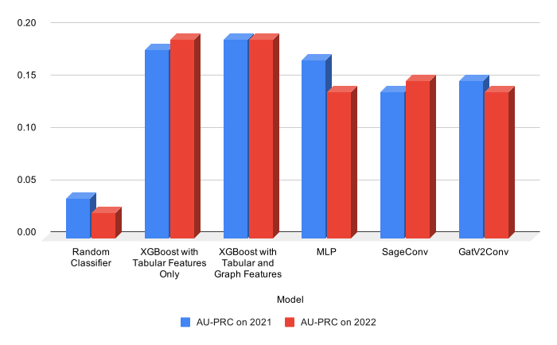

# Graph Neural Networks for Financial Anomaly Detection on FiGraph

**Problem:** Financial anomalies at listed companies harm investors and are costly to detect. They often involve relationships with other entities, such as related-party transactions, shared auditors or investment ties, which help enable or conceal the anomaly. A model that looks only at a company's own financials may miss anomalies that appear only in its network of relationships.

**Goal:** Build a GNN classifier that detects financial anomalies using a company's network of relationships, and compare it with models trained on financial attributes alone.

**Approach:** [FiGraph](https://github.com/XiaoguangWang23/FiGraph) is a real-world dynamic heterogeneous graph of listed companies, people, auditors and other related entities, with anomaly labels for the companies. Anomaly detection is treated as node classification on the listed-company nodes.
The target models are two GNNs (GraphSAGE and GATv2), compared against an MLP, a tabular-only XGBoost and a graph-enhanced XGBoost.

Setup and commands to reproduce the results are in [README.md](README.md).

## Table of Contents
1. [The Data](#the-data)
2. [Exploratory Analysis](#exploratory-analysis)
    1. [Exploratory Data Analysis](#exploratory-data-analysis)
    2. [Graph Exploratory Data Analysis](#graph-exploratory-data-analysis)
3. [Predictive Modeling](#predictive-modeling)
    1. [Baseline Models](#baseline-models)
    2. [Neural Network Models](#neural-network-models)
4. [Model Performance](#model-performance)
5. [Conclusion](#conclusion)
    1. [Lessons Learned](#lessons-learned)
    2. [Next Steps](#next-steps)

## The Data
All data comes from [FiGraph](https://github.com/XiaoguangWang23/FiGraph), introduced in [FiGraph: A Dynamic Heterogeneous Graph Dataset for Financial Anomaly Detection](https://dl.acm.org/doi/abs/10.1145/3701716.3715301).

It contains three types of data:
1. Tabular features: 775 financial and registration attributes per listed company, one snapshot per year from 2014 to 2022.
2. Graph relationships: a heterogeneous graph of listed companies, people, auditors and other related entities.
3. Text data, which is out of scope for this project.

The graph is temporal: node features and edges are indexed by year, and the graph grows over time.

## Exploratory Analysis

### Exploratory Data Analysis
The tabular data is explored in [01_eda.ipynb](01_eda.ipynb).
The analysis focuses on which columns are safe to use as model inputs and on how the data changes over time.
The notebook ends with a list of columns to modify, which is used by the modeling pipeline.

#### Column Structure
By naming convention, the 775 columns fall into six groups:
- `A*`: balance sheet
- `B*`: income statement
- `C*` and `D*`: cash flow
- `F*`: financial ratios (largest group)
- Other: columns with descriptive names (e.g. `ZScore`)

A subgroup code further splits the statement groups into standard features (`00`, applies to all companies) and features specific to banks, financial institutions and insurers (`0b`, `0d`, `0f`, `0i`, ...).
Non-`00` columns are always empty for companies outside their subgroup, so this missingness is structural, not random.

#### Column Filtering
Besides identity-revealing columns and columns with more than 99% missing values, the notebook drops:
- columns marked as discontinued in their description,
- columns introduced after the end of the training window, since they are unavailable for any training year,
- `nodeID` and `Year`, which are identifiers, not features.

Columns introduced during the training window are kept but flagged, because they are empty in the years before their introduction. This missingness is not random, unlike missing values within an active column.

#### Panel Growth
- The number of companies grows every year as new companies are added.
- Of all companies that appear in 2014-2020, 60% are present in all 7 years.

#### Class Imbalance
| Year | Companies | Anomalous | Positive rate |
|-|-|-|-|
| 2014 | 2,631 | 95 | 3.6% |
| 2015 | 2,824 | 134 | 4.7% |
| 2016 | 3,125 | 173 | 5.5% |
| 2017 | 3,503 | 205 | 5.9% |
| 2018 | 3,596 | 225 | 6.3% |
| 2019 | 3,815 | 214 | 5.6% |
| 2020 | 4,269 | 207 | 4.8% |
| 2021 | 4,769 | 183 | 3.8% |
| 2022 | 5,132 | 123 | 2.4% |

On average, 5.3% of company-years in 2014-2020 are labeled anomalous.
The rate peaks in 2018 and then declines, so the test years (2021-2022) have the fewest positives.

At the company level, most companies have no anomalous year in this period, and the number of companies drops sharply as the number of anomalous years increases. Repeat offenders are rare.

More details are in the [tabular EDA notebook](01_eda.ipynb).

### Graph Exploratory Data Analysis
The graph data is explored in [02_graph_eda.ipynb](02_graph_eda.ipynb), focusing on the graph structure and how it changes over time.

#### Graph Structure
- 5 node types, identified by the first character of the node ID: **L** (Listed Company), **U** (Unlisted Company), **H** (Human), **A** (Audit Institution), **O** (Other, e.g. government agency, school).
- 4 edge types, each limited to specific node-type pairs: Audit (L-A only), Supply chain (L-L only), Investment and Related-party transaction (L-U, L-H, L-L, L-O).
- Edges are undirected, with no self-loops and no duplicates within a year. The same edge can appear again in other years.
- The graph is consistent with the tabular data: every company with a tabular row has an **L** node, and vice versa.

#### Graph Properties
- The graph grows every year, from 53,678 nodes and 79,958 edges in 2014 to 97,386 nodes and 135,814 edges in 2020.
- It is connected and very sparse in every year (density $\sim3*10^{-5}$ to $\sim6*10^{-5}$), with a constant diameter of 8 and low average clustering (0.02-0.03).
- Connectivity is concentrated in **A** nodes (median degree 32-40) and **L** nodes (median degree 25-29). **H**, **O** and **U** nodes are mostly leaves (degree 1) and contribute little to message passing.
- Related-party transaction and Investment edges make up about 97% of edges, Audit about 3% and Supply chain less than 1%.
- By node-type pair, L-U accounts for about 60% of edges, L-H about 30% and L-L about 10%.

#### Financial Anomalies and Graph Structure
Anomalous and non-anomalous companies have nearly identical degree distributions. Their neighborhoods differ only slightly: anomalous companies have somewhat more listed-company and "other" neighbors and fewer human neighbors, and they are not noticeably more likely to neighbor other anomalous companies.

To test this more formally, the notebook runs a permutation test for homophily on each edge type:
- Excess homophily is computed per edge type and compared with its distribution under label permutation, giving a p-value and z-score. This shows whether anomalies cluster together more than chance would predict.
- The test uses the `edge_insensitive` method with 100 permutations (fewer than the default, for speed).
- Excess homophily is close to zero for every edge type, so there is no meaningful tendency for anomalous companies to cluster together in the graph.

This sets expectations for [Model Performance](#model-performance): if anomalies do not spread through direct connections, any GNN advantage over the tabular baselines would have to come from more indirect structural signal.

More details are in the [graph EDA notebook](02_graph_eda.ipynb).

## Predictive Modeling

### Baseline Models
The GNNs are compared against two XGBoost baselines, one on tabular features only and one with added graph features, and an MLP (see [Feed Forward Neural Network (MLP)](#feed-forward-neural-network-mlp)).

#### Tabular Baseline
The tabular features are the company attributes provided by FiGraph, minus the columns removed in [Column Filtering](#column-filtering).
No imputation is done, since XGBoost handles missing values natively.
Columns are selected in [01_eda.ipynb](01_eda.ipynb), and the model is trained in [anomaly_detector/baseline/xgb_tabular.py](anomaly_detector/baseline/xgb_tabular.py).

#### Graph-Enhanced Baseline
The graph features are hand-engineered summaries of each company's neighborhood: its degree, the number of neighbors of each node type and the number of edges of each relationship type.
They are explored in [02_graph_eda.ipynb](02_graph_eda.ipynb), and the model is trained on the tabular features plus these graph features in [anomaly_detector/baseline/xgb_tabular_graph.py](anomaly_detector/baseline/xgb_tabular_graph.py).

#### Baseline Hyperparameter Tuning
Both baselines use hand-tuned hyperparameters, with early stopping on the validation set to choose the number of boosting rounds.

An Optuna hyperparameter search is available in [anomaly_detector/baseline/xgboost_hyperoptim.py](anomaly_detector/baseline/xgboost_hyperoptim.py). It was not used for the reported results, since it did not improve on the hand-tuned hyperparameters.
Optuna runs can be viewed in the Optuna dashboard (see the Reproducing the Results section in [README.md](README.md)).

### Neural Network Models
These models are implemented in [anomaly_detector/gnn_classifier](anomaly_detector/gnn_classifier) and trained with [anomaly_detector/gnn_classifier/train.py](anomaly_detector/gnn_classifier/train.py). Class imbalance is handled with `BCEWithLogitsLoss` weighted by the positive-class ratio of the training years.

The listed-company node features are the same tabular features used by the baselines, preprocessed for neural networks in [anomaly_detector/graph/node_features.py](anomaly_detector/graph/node_features.py). Categorical columns are one-hot encoded. Numerical columns are median-imputed, with a missing-value indicator column added for each, and mapped to a normal distribution with `QuantileTransformer`.
The preprocessor is fit on the training years only, to avoid leakage.

#### Feed Forward Neural Network (MLP)
The MLP uses only the tabular features of the listed companies, without the graph. It has a single hidden layer (Linear -> ReLU -> Dropout -> Linear) and is implemented in [anomaly_detector/gnn_classifier/mlp_classifier.py](anomaly_detector/gnn_classifier/mlp_classifier.py).
Since it shares the GNN's features, preprocessing and training loop, the difference between the MLP and the GNN shows how much the graph contributes.

#### Graph Neural Network (GNN)
Two GNN architectures are implemented in [anomaly_detector/gnn_classifier](anomaly_detector/gnn_classifier): GraphSAGE and GATv2. Each has two message-passing layers, made heterogeneous with PyG's `to_hetero` (a separate convolution per relationship type).
- Listed companies are the target nodes. They carry the labels, and a linear layer projects their preprocessed tabular features into the hidden space.
- All other node types (people, unlisted companies, other entities) have no labels and no features. Each type has a single learnable embedding shared by all its nodes, so they act as typed relays for messages between companies.
- A linear classification head on the final listed-company embeddings outputs the anomaly logit.

Before training, the yearly graphs are simplified in [anomaly_detector/gnn_classifier/dataset.py](anomaly_detector/gnn_classifier/dataset.py) by dropping Audit edges. Auditors are hubs connecting many companies and may cause over-smoothing. The cost is losing the shared-auditor signal.

Each year is a separate graph, and the GNN is trained on one full yearly graph per step, without neighbor sampling.
Early stopping monitors AU-PRC on the validation year.

#### NN Hyperparameter Tuning
The neural network hyperparameters were tuned by hand, with the learning rate, hidden layer size and dropout selected on the validation set.
Training is logged to TensorBoard (see the Reproducing the Results section in [README.md](README.md)).

## Model Performance
Each model is run on two splits: train up to year *T-2*, validate on *T-1*, test on *T*.
The validation year is used for early stopping and threshold selection. The test year is always the year after the validation year, so the test columns measure performance one year forward.

### Model Comparison

### Detailed Results
| Model | Trained on | Val year | Val pos. rate (%) | Val MCC (1) | Val AU-PRC (1) | Val AU-ROC | Test year | Test pos. rate (%) | Test MCC (2) | Test AU-PRC | Test AU-ROC |
|-|-|-|-|-|-|-|-|-|-|-|-|
| XGBoost Tabular | 2014-2019 | 2020 | 4.8% | 0.39 | 0.36 | 0.85 | 2021 | 3.8% | 0.21 | 0.18 | 0.80 |
| XGBoost Tabular | 2014-2020 | 2021 | 3.8% | 0.37 | 0.32 | 0.86 | 2022 | 2.4% | 0.21 | 0.19 | 0.84 |
| XGBoost Tabular + Graph | 2014-2019 | 2020 | 4.8% | 0.39 | 0.38 | 0.85 | 2021 | 3.8% | 0.20 | 0.19 | 0.77 |
| XGBoost Tabular + Graph | 2014-2020 | 2021 | 3.8% | 0.37 | 0.33 | 0.87 | 2022 | 2.4% | 0.21 | 0.19 | 0.84 |
| MLP | 2014-2019 | 2020 | 4.8% | 0.29 | 0.28 | 0.82 | 2021 | 3.8% | 0.20 | 0.17 | 0.78 |
| MLP | 2014-2020 | 2021 | 3.8% | 0.22 | 0.22 | 0.82 | 2022 | 2.4% | 0.20 | 0.14 | 0.84 |
| SageConv | 2014-2019 | 2020 | 4.8% | 0.30 | 0.28 | 0.84 | 2021 | 3.8% | 0.18 | 0.14 | 0.78 |
| SageConv | 2014-2020 | 2021 | 3.8% | 0.21 | 0.18 | 0.80 | 2022 | 2.4% | 0.20 | 0.15 | 0.84 |
| GatV2Conv | 2014-2019 | 2020 | 4.8% | 0.31 | 0.25 | 0.83 | 2021 | 3.8% | 0.20 | 0.15 | 0.77 |
| GatV2Conv | 2014-2020 | 2021 | 3.8% | 0.22 | 0.22 | 0.81 | 2022 | 2.4% | 0.18 | 0.14 | 0.81 |

*Note: Each result is from a single run, so small differences (0.01-0.02) may be noise.*

(1) Not a performance estimate. Early stopping monitors validation AU-PRC and the MCC threshold is chosen on the same year, so both values are optimistic upper bounds. The MCC is more so, since both the epoch and the threshold were fitted to it.

(2) At the threshold selected on the validation year.

#### Reading the validation-to-test gap
The validation columns are reported to show the drop to the test year, which is the practical cost of deploying the model one year forward. Two caveats apply:
- The gap combines two effects, optimism from selecting on the validation year and real year-over-year drift. These are not separated here, as that would require extra runs beyond the scope of this project.
- The positive rate also drifts (3.8% in 2021 to 2.4% in 2022). AU-PRC is sensitive to the positive rate and AU-ROC is not, so a lower AU-PRC does not by itself mean worse ranking.

### A Practical Problem With This Setup
The final model is never trained on the validation year, although it is the year closest to the test year. A better setup would use the validation year only for hyperparameter selection, then retrain on all years including it. This was left out due to time, but it only requires one extra training run per model.

## Conclusion
The GNNs (GraphSAGE and GATv2) did not outperform the tabular XGBoost baseline on test AU-PRC or AU-ROC in either split, and performed about the same as the MLP trained on the same features without the graph.
Adding hand-engineered graph features to XGBoost did not consistently help either.
This agrees with the graph EDA: anomalies show no significant homophily, so there is little relational signal for message passing to use.

XGBoost on tabular features alone performs as well as any model tested, and is the simplest and cheapest, which makes it the best choice for this task.

### Lessons Learned
1. A simple homophily test predicted the GNN outcome. The permutation test found no anomaly clustering in the graph, and the GNNs performed no better than the same features without the graph. Such a test gives an early indication of whether a GNN is likely to help.

2. An MLP is the right ablation for a GNN. It shares the GNN's features, preprocessing and training loop, so the gap between them shows what the graph adds. Here the gap was about zero, which is more informative than the XGBoost comparison alone.

3. Gradient boosting is hard to beat on messy financial tables. XGBoost handles missing values natively, while the neural models needed imputation, missing-value indicators and quantile scaling, and still trailed on test AU-PRC.

4. Prevalence drift across years matters. The positive rate fell from 3.8% to 2.4%, which alone can lower AU-PRC.

### Next Steps
1. Add ranking metrics: `Precision@k` and `Recall@k` (e.g. top 5% of companies) do not depend on a threshold and match how an auditor would use the model.

2. Retrain on training and validation data: tune on the validation year, then retrain on all years including it (see [A Practical Problem With This Setup](#a-practical-problem-with-this-setup)).

3. Try a model that captures global structure, such as GraphGPS: some GNN architectures are designed to capture global graph structure rather than only local neighborhoods. If anomalies leave a global structural signal, such models may improve performance.
